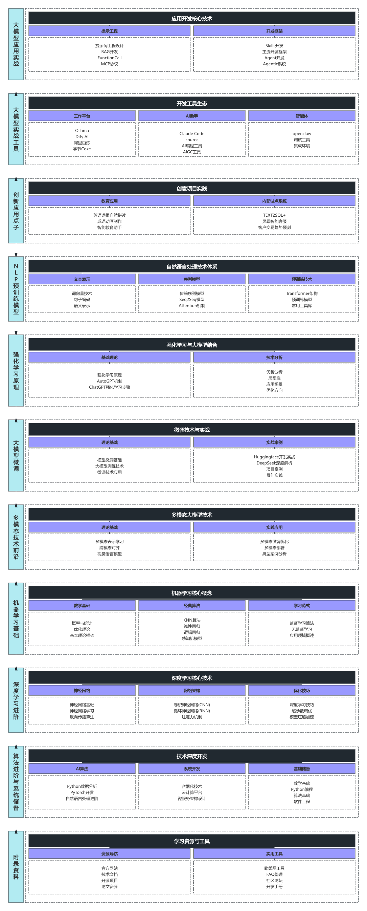

<div align="center">

# 🚀 LLM Roadmap

## 大模型全栈知识体系

<p>
  
  
  
  
  
  
  
  
  
  
</p>

<p><strong>应用开发｜ 模型优化微调 ｜ 强化学习对齐 </strong></p>

<p>
  <a href="#/README?id=项目总览">项目总览</a> •
  <a href="#/README?id=构建体系">构建体系</a> •
  <a href="#/README?id=快速开始">快速开始</a> •
  <a href="#/README?id=贡献指南">贡献指南</a>
</p>

</div>

---

## 项目总览

<div align="center">
  
  <p><em>LLM全栈开发学习路线全景图 - 从应用实战到底层基础</em></p>
</div>

### 核心理念

> **逆向工程式学习法**：先上手做生产级应用，再深挖底层原理

本项目采用「自顶向下」的学习路径，从大模型应用实战开始，逐步深入到底层理论基础：

```
┌─────────────────────────────────────────────────────────┐
│  入口：大模型应用模块（Prompt、RAG、Agent、MCP、Skills）     │
│    ↓                                                    │
│  工具：大模型实战工具（本地部署、低代码平台、AI编程）     │
│    ↓                                                    │
│  落地：创新应用落地（Vibe Coding、教育场景、企业系统）         │
│    ↓                                                    │
│  理论：NLP与预训练、强化学习对齐、模型微调、多模态技术             │
│    ↓                                                    │
│  了解：机器学习、深度学习（CNN、RNN）                     │
│    ↓                                                    │
│  基础：算法与系统底层储备、基础语言                                │
│    ↓                                                    │
│  资源：附录资料与工具集                                  │
└─────────────────────────────────────────────────────────┘
```

---

## 构建体系

### 📌 一、大模型应用

> **快速上手** | 直接开始大模型应用开发，跑出可落地的MVP

#### 1.1 Prompt Engineering 提示词工程

```typescript
interface PromptEngineering {
  基础规范: "角色定义 | 目标拆解 | 执行方案 | 输出格式约束";
  调优策略: "Zero-Shot | Few-Shot | CoT链式思维 | Self-Consistency";
  高级能力: "多步骤任务编排 | 幻觉抑制 | 长文本上下文优化";
  实战场景: "使用技巧 | step by step 实现 | 文本分类 | 多轮对话设计";
}
```

#### 1.2 RAG 检索增强生成

```typescript
interface RAG_System {
  数据层: "文档解析 | 分块策略 | 清洗归一化";
  向量层: "Embedding模型 | 文本向量化 | 向量数据库";
  检索层: "向量检索 | 关键词召回 | 重排序 | 相似度匹配";
  生成层: "Prompt融合 | 上下文注入 | 幻觉抑制";
  进阶路径: "NaiveRAG → AdvancedRAG → GraphRAG → AgenticRAG";
}
```

#### 1.3 Function Call & Agent 智能体

```typescript
interface LLM_Agent {
  核心模块: "规划Planning | 记忆Memory | 工具Tools | 执行Action";
  基础能力: "Function Call工具调用 | 多工具协同 | 异常重试";
  进阶能力: "Workflow工作流编排 | 多智能体Multi-Agent协同";
  落地场景: "自动化办公助手 | 数据分析Agent | 舆情监控系统";
}
```

#### 1.4 MCP 模型上下文协议

```typescript
interface MCP_Protocol {
  核心组件: "Model Server | Client Application | Protocol Specification";
  核心优势: "标准化模型交互 | 提升开发效率 | 增强系统灵活性";
  应用场景: "SaaS产品集成 | 跨模型统一调用 | 企业级AI中台";
}
```

---

### 🛠️ 二、大模型实战工具

> **效率提升** | 掌握工业级大模型开发工具链

| 分类 | 工具 | 核心能力 | 适用场景 |
|------|------|----------|----------|
| 本地部署 | **Ollama** | 私有化模型管理、多语言API、离线运行 | 本地开发、数据安全 |
| 低代码平台 | **Dify AI** | 可视化工作流、知识库、Agent开发 | 企业应用、快速MVP |
| 低代码平台 | **Coze** | 工作流编排、插件开发、多端部署 | AIGC内容、小程序 |
| AI编程 | **Cursor** | 智能补全、代码重构、多语言支持 | 全栈开发、效率提升 |
| AIGC工具 | 视频图片创作、知识学习、开发手册 | 内容创作、学习辅助 |

---

### 💡 三、创新应用落地

> **MVP实践** | 将技术落地到真实场景

#### 生产提效

#### 教育场景应用
- **英语词根自然拼读工具**：基于大模型的个性化英语学习助手
- **成语动画自动生成系统**：输入成语自动生成故事脚本、分镜与动画
- **智能教育助手**：多学科知识点讲解、习题生成、个性化学习计划

#### 企业内部系统应用
- **TEXT2SQL+ 智能数据查询**：自然语言转SQL，支持多数据库对接
- **基于RAG的智能客服系统**：企业知识库对接、多轮对话、工单自动生成
- **客户交易趋势预测系统**：基于大模型的数据分析、趋势预测、风险预警

---

### 📝 四、NLP与预训练核心

> **理论核心** | 深入理解大模型背后的NLP核心理论

```
┌─────────────────────────────────────────────────────────┐
│                    NLP技术体系架构                        │
├─────────────────────────────────────────────────────────┤
│  📄 文本表示层                                            │
│     └─ Tokenization → 词表构建 → Word Embedding          │
│                                                          │
│  🔄 序列模型层                                            │
│     └─ RNN → LSTM → GRU → Seq2Seq编解码器                │
│                                                          │
│  ⚡ 核心机制层                                            │
│     └─ Attention注意力 → Transformer架构                  │
│                                                          │
│  🤖 预训练层                                              │
│     └─ GPT自回归 → BERT双向编码 → 开源生态                │
└─────────────────────────────────────────────────────────┘
```

---

### 🎮 五、强化学习与模型对齐

> **模型对齐** | 掌握RLHF等大模型对齐技术

```typescript
interface RL_Alignment {
  基础理论: "强化学习核心原理 | MDP马尔可夫决策过程";
  核心方案: "RLHF人类反馈强化学习 | RLAIF AI反馈 | DPO直接偏好优化";
  工程实现: "AutoGPT机制 | ChatGPT强化学习完整步骤";
  优化方向: "模型安全性 | 输出一致性 | 幻觉抑制";
}
```

---

### ⚙️ 六、模型微调与定制

> **领域定制** | 针对业务场景打造专属领域模型

| 基础理论 | 核心技术 | 工具链 |
|----------|----------|--------|
| 预训练模型适配 | LoRA / QLoRA | Huggingface Transformers |
| 增量预训练 | Full Finetune | PEFT |
| 指令微调 | 多模态微调 | Accelerate |
| 领域适配 | 参数高效微调 | DeepSpeed |

---

### 👁️ 七、多模态技术

> **能力扩展** | 将大模型能力扩展到图像、音频、视频

```typescript
interface MultiModal_LLM {
  理论基础: "多模态表示学习 | 跨模态对齐 | 视觉语言模型";
  工程实现: "多模态微调优化 | 多模态部署 | 推理加速";
  落地场景: "图文生成 | 视频理解 | 语音交互 | 数字人 | 多模态RAG";
}
```

---

### 📊 八、机器学习基础

> **基础理论** | 补全机器学习核心理论

| 分类 | 核心内容 |
|------|----------|
| 数学基础 | 概率与统计、线性代数、优化理论、信息论 |
| 经典算法 | KNN、线性回归、逻辑回归、决策树、聚类算法 |
| 学习范式 | 监督学习、无监督学习、半监督学习、强化学习 |
| 评估体系 | 模型评估指标、过拟合与欠拟合、泛化能力优化 |

---

### 🧠 九、深度学习进阶

> **核心原理** | 深入理解深度学习核心技术

```typescript
interface DeepLearning_System {
  基础单元: "神经网络基础 | 神经元 | 激活函数 | 损失函数 | 反向传播";
  核心架构: "CNN卷积神经网络 | RNN循环神经网络 | Transformer注意力架构";
  优化方法: "梯度下降 | 超参数调优 | 正则化 | 模型压缩 | 推理加速";
  工程实现: "PyTorch | TensorFlow | 分布式训练 | 生产级部署";
}
```

---

### 🔰 十、算法与系统底层

> **底层储备** | 补全算法、编程与工程的底层能力

| 分类 | 核心能力 |
|------|----------|
| AI算法能力 | Python数据分析、PyTorch开发、NLP进阶、算法基础 |
| 系统开发能力 | 容器化Docker/K8s、云计算平台、微服务架构设计 |
| 工程能力 | 软件工程、版本控制Git、CI/CD、线上运维、故障排查 |
| 基础储备 | 数学基础、Python编程、计算机网络、操作系统 |

---

### 📎 十一、附录资料与工具集

> **持续学习** | 建立持续学习的资源体系

#### 资源导航
- **官方文档**：主流大模型官方API文档、开源项目官方文档
- **开源项目**：GitHub优质大模型开源项目、工具链、落地案例
- **论文资源**：顶会论文、前沿技术论文、经典论文合集
- **学习社区**：HuggingFace、GitHub、Stack Overflow、国内技术社区

#### 实用工具
- **开发工具**：路线图工具、API调试工具、模型部署工具
- **学习辅助**：FAQ整理、面试题库、开发手册、最佳实践合集
- **社区交流**：技术论坛、开源社区、开发者社群

---

## 快速开始

### 环境准备

```bash
# 1. 克隆项目
git clone https://github.com/javelindot/llm-roadmap.git
cd llm-roadmap

# 2. 本地预览（可选）
npx docsify-cli serve -p 3000
# 访问 http://localhost:3000

# 3. 开始学习
# 建议从「大模型应用实战」开始，自顶向下学习
```

### 学习建议

**入门路径（0-3个月）**：
```
Week 1-2:  Prompt Engineering 提示词工程
Week 3-4:  RAG 检索增强生成系统搭建
Week 5-6:  Function Call & Agent 智能体开发
Week 7-8:  创新应用落地实战
```

**进阶路径（3-6个月）**：
```
Month 3: NLP与预训练核心理论
Month 4: 模型微调与定制化实战
Month 5: 强化学习与模型对齐
Month 6: 多模态技术前沿
```

---

## 贡献指南

我们欢迎所有形式的贡献！

```bash
# Fork 项目
git clone https://github.com/your-username/llm-roadmap.git

# 创建特性分支
git checkout -b feature/your-contribution

# 提交你的更改
git commit -m "docs: add xxx module content"

# 推送到分支
git push origin feature/your-contribution

# 创建 Pull Request
```

### 贡献内容规范

| 类型 | 说明 |
|------|------|
| 内容补充 | 补充各模块学习资料、实战代码、落地案例 |
| 错误修正 | 修正内容错误、优化知识结构与表述 |
| 工具分享 | 分享优质工具、项目点子与行业实践 |
| 格式优化 | 完善文档格式、修复显示问题 |

---

## 开源许可

本项目采用 [MIT License](./LICENSE) 开源协议。

---

<div align="center">

## 📚 学习资源与社区

### 如何贡献
- **Star 支持**：如果你觉得这个项目有价值，请给它一个 Star ⭐
- **Issue 反馈**：遇到问题或有建议，欢迎提交 Issue
- **PR 贡献**：欢迎提交 Pull Request 改进代码和文档
- **分享传播**：将项目分享给更多需要的开发者

### 技术交流
- **问题讨论**：在 Issue 中提出技术问题
- **经验分享**：分享你的 LLM 实践经验
- **合作机会**：寻找志同道合的技术伙伴

</div>
