# 2026 年通用型 AI Agent 技术学习指南

本文的内容结构如下：

- 第 1 章：引言，介绍 2026 年 AI Agent 技术发展概述
- 第 2 章：核心技术原理与架构设计，详细介绍通用型 Agent 的技术架构和运行机制
- 第 3 章：关键技术组件详解，深入分析大语言模型、工具调用、记忆机制等核心组件
- 第 4 章：实践案例与代码实现，提供具体的开发案例和代码示例
- 第 5 章：可视化技术实现，介绍如何使用代码绘制技术图表
- 第 6 章：学习资源与发展趋势，提供学习路径和技术发展展望

## 1. 引言：2026 年 AI Agent 技术发展概述

### 1.1 技术发展背景与趋势

2026 年标志着 AI 技术从 "生成内容" 向 "执行任务" 的历史性转变，通用型 AI Agent 成为这一变革的核心驱动力。根据行业预测，到 2026 年底将有 40% 的企业应用集成任务专属 AI Agent，这一数字相比 2025 年的不足 5% 增长了 8 倍。这一爆发式增长背后，是技术成熟度、成本下降和需求爆发三大因素的共同推动。

技术成熟度方面，GPT-5.4、Claude Opus 4.5、Gemini 3.1 Pro 等新一代大语言模型在推理能力、工具调用、长文本理解等方面取得突破性进展，为 Agent 提供了可靠的 "大脑"。特别是在 2026 年 2-3 月期间，主要科技公司密集发布了一系列革命性产品：OpenAI 推出了具备原生 "操作电脑" 能力的 GPT-5.4 和 Operator 智能体，谷歌发布了 A2A（Agent-to-Agent）协议候选版本 1.0，英伟达推出了开源 AI Agent 平台 NemoClaw。

成本效益的显著改善也是推动技术普及的关键因素。企业级 Agent 的开发成本下降 40%，推理延迟降至 200ms，功能复用率提升 60%。同时，AI Agent 的应用正在从 "技术演示" 走向 "规模价值"，在营销、招聘、客服等场景已形成可复用的落地样本。

### 1.2 通用型 Agent vs 专用型 Agent

通用型 AI Agent 与专用型 Agent 在设计理念、技术架构和应用场景上存在本质差异。理解这些差异对于选择合适的学习路径至关重要。

**设计理念差异**：通用型 Agent 追求 "一专多能"，具备处理跨领域任务的能力，而专用型 Agent 则专注于特定领域的深度优化。通用型 Agent 采用 "少即是多" 的设计哲学，通过灵活的架构和强大的推理能力来应对多样化需求；专用型 Agent 则通过领域知识的深度集成和定制化优化来实现专业化能力。

**技术架构对比**：通用型 Agent 通常采用模块化、可插拔的架构设计，核心组件包括感知模块、决策模块、执行模块、记忆模块和反思模块。这种架构允许 Agent 根据任务需求动态加载和组合不同的能力。相比之下，专用型 Agent 的架构更加固化，往往针对特定任务进行了深度优化，例如金融风控 Agent 会集成专门的风险评估算法和合规规则引擎。

**应用场景分析**：通用型 Agent 适用于需求多变、领域交叉的复杂场景，如综合型智能助手、跨部门协作系统等。典型应用包括个人数字助理、企业知识管理系统、多模态内容创作平台等。专用型 Agent 则在垂直领域表现出色，如医疗诊断系统、金融交易机器人、工业质检系统等。根据行业实践，80/20 法则表明 80% 的场景适合通用型 Agent，20% 的关键场景需要专用型 Agent。

**性能特征比较**：在任务完成度方面，专用型 Agent 通常在其专业领域内表现优于通用型 Agent，但在跨领域任务处理上存在明显局限。通用型 Agent 在单一任务上可能不如专用型 Agent 高效，但其泛化能力和适应性更强。例如，在代码生成任务上，专用的代码生成 Agent 可能生成更优化的代码，但通用型 Agent 能够同时处理代码生成、文档撰写、数据分析等多种任务。

### 1.3 学习目标与内容结构

本文旨在为大家提供 2026 年通用型 AI Agent 的全面技术解析，重点关注核心原理、架构设计、关键技术组件和实践案例。学习目标包括：

1. 理解通用型 AI Agent 的核心技术原理和运行机制
2. 掌握 2026 年主流的 Agent 架构设计模式和技术栈
3. 学会使用可视化工具（流程图、时序图）来描述技术原理
4. 能够基于主流框架实现简单的 Agent 应用
5. 了解 2026 年技术发展趋势和前沿方向

## 2. 核心技术原理与架构设计

### 2.1 通用型 AI Agent 系统架构

通用型 AI Agent 的系统架构体现了 "感知 - 决策 - 执行 - 反馈 - 优化" 的完整智能闭环。2026 年的主流架构采用模块化设计，将复杂的智能行为分解为多个相对独立又相互协作的功能模块。

**分层架构设计**：现代通用型 Agent 采用多层次的架构设计，通常包括用户交互层、核心控制层、能力执行层和基础设施层。用户交互层负责与外部环境的信息交换，支持文本、语音、图像等多模态输入输出；核心控制层作为 "交通枢纽"，承接用户输入并向下调度各个功能模块，同时负责上下文管理、实体识别和最终响应生成；能力执行层包含知识检索、决策执行、工具调用等具体功能；基础设施层提供安全、监控、日志等支撑服务。

**模块化组件详解**：

1. **感知模块（Perception）**：负责接收和理解外部环境信息，包括用户指令、工具返回结果、环境变化等。该模块采用多模态融合技术，能够同时处理文本、图像、音频等多种信息源。
2. **决策模块（Decision/Planning）**：基于感知信息进行推理和规划，将复杂目标分解为可执行的子任务序列。该模块采用 ReAct（Reason+Act）框架，通过 "思考 - 行动" 循环来实现智能决策。
3. **执行模块（Execution）**：负责调用外部工具、执行具体操作，包括 API 调用、数据库查询、文件操作等。2026 年的执行模块普遍支持 MCP（Model Context Protocol）协议，实现标准化的工具调用。
4. **记忆模块（Memory）**：提供短期记忆（对话上下文）和长期记忆（历史经验、用户偏好）功能。采用向量数据库技术实现高效的语义检索和相似性匹配。
5. **反思模块（Reflection）**：评估执行结果，诊断问题并调整策略。该模块能够进行自我纠错和策略优化，形成学习闭环。

**2026 年架构创新**：2026 年的 Agent 架构出现了多项重要创新。首先是 Graph-Enhanced Architecture（GEA）的兴起，基于有向无环图（DAG）的架构成为主流，通过路由模型实现技能间的灵活调度与数据流管控。其次是多智能体协作架构的成熟，从 "独狼" 助手进化为 "狼群" 战术，MCP 与 A2A 通信协议成为行业标准。第三是安全架构的强化，包括权限收敛、人工兜底、对抗性测试等机制的完善。

### 2.2 运行机制详解

通用型 AI Agent 的运行机制基于 "观察 - 思考 - 行动 - 反思" 的循环模式，这一机制在 2026 年得到了进一步的优化和完善。

**基本运行循环**：Agent 的核心运行机制遵循 OODA 循环（观察 - 调整 - 决策 - 行动），但 2026 年的实现更加智能化和自动化。在观察阶段，Agent 通过感知模块获取环境信息；在思考阶段，通过决策模块进行任务分解和路径规划；在行动阶段，通过执行模块调用工具或执行操作；在反思阶段，评估结果并优化后续策略。这一循环不断迭代，直到完成目标或达到终止条件。

**任务分解与规划**：现代 Agent 具备强大的任务分解能力，能够将复杂目标自动拆解为可执行的子任务序列。例如，当用户提出 "策划一次团队旅行" 的请求时，Agent 会自动分解为查询目的地信息、比较机票价格、预订酒店、安排行程等子任务，并确定执行顺序和依赖关系。规划过程采用分层规划算法，从抽象目标逐步细化为具体动作，同时考虑资源约束和时间窗口。

**工具调用流程**：2026 年的 Agent 工具调用已实现高度标准化。基于 MCP 协议，Agent 能够安全、统一地调用各种外部工具，无需为每个工具编写特定的集成代码。调用流程包括：意图识别（确定需要调用的工具类型）、参数构建（将自然语言转换为工具所需的结构化参数）、安全验证（检查调用权限和参数合法性）、执行调用（发送请求并等待响应）、结果解析（将工具返回结果转换为可理解的信息）。

**动态调整机制**：Agent 具备实时调整策略的能力，能够根据执行结果和环境变化动态修改规划。当遇到意外情况时，Agent 会进行根本原因分析（RCA），识别问题根源并制定解决方案。例如，如果某个工具调用失败，Agent 会尝试使用备用工具或调整参数重新调用；如果发现原定路径效率低下，会重新规划最优路径。

### 2.3 关键技术原理

2026 年通用型 AI Agent 的核心技术原理体现在多个方面，这些原理的突破推动了 Agent 能力的质的飞跃。

**大模型推理机制**：现代 Agent 以大语言模型为核心大脑，通过强大的推理能力实现复杂任务理解和处理。2026 年的模型在推理能力上实现了重大突破，例如 Gemini 3.1 Pro 在 ARC-AGI-2 测试中的得分从 31.1% 飙升至 77.1%。推理机制包括链式推理（Chain of Thought）、反向推理、类比推理等多种模式，能够处理多跳推理、因果推理、反事实推理等复杂任务。

**多模态融合原理**：2026 年的 Agent 实现了真正的多模态原生融合，彻底告别了 "文本 + 图像" 的简单拼接模式。通过统一的向量空间表示，文本、图像、音频、视频等不同模态的数据能够在同一语义空间中进行对齐和交互。关键技术包括统一 Token 化（将非文本数据转换为与文本同构的 Token 序列）、交叉注意力优化（实现模态间的高效信息流动）、稀疏激活（仅激活相关模态以减少计算开销）。

**记忆增强机制**：Agent 的记忆系统采用 "短期记忆 + 长期记忆" 的双层架构。短期记忆基于注意力机制实现，能够保存当前对话的上下文信息；长期记忆采用向量数据库技术，将知识和经验编码为高维向量进行存储和检索。2026 年的记忆机制在容量和效率上都有显著提升，支持百万级 Token 的上下文处理，检索速度达到毫秒级。

**安全对齐技术**：随着 Agent 能力的增强，安全对齐成为关键技术挑战。2026 年的 Agent 采用多层次的安全机制，包括行为监控（实时检测异常行为）、权限控制（基于角色的访问控制）、内容过滤（识别和阻止有害内容）、审计追踪（记录所有操作日志）等。同时，通过强化学习从人类反馈中学习（RLHF）来优化 Agent 的行为，确保其与人类价值观保持一致。

## 3. 关键技术组件详解

### 3.1 大语言模型核心能力

2026 年的大语言模型在通用型 Agent 中扮演着 "大脑" 的角色，其能力的提升直接决定了 Agent 的智能化水平。主要模型厂商在这一年推出了多项突破性产品。

**GPT-5.4 技术突破**：OpenAI 在 2026 年 3 月发布的 GPT-5.4 带来了革命性的变化，首次加入了原生 "操作电脑" 能力，能够直接与计算机系统交互执行各种任务。在推理能力方面，GPT-5.4 实现了 10 倍的提升，在复杂推理任务上表现出色。模型还增强了代码生成能力，直接继承了 GPT-5.3-Codex 的代码生成能力并进一步优化了图像感知与多模态任务处理能力。

**Claude 4 系列创新**：Anthropic 推出的 Claude 4 系列在 2026 年实现了多项技术突破。Claude 4 Opus 在安全性、拟人化和长文本处理方面表现卓越，特别适合需要谨慎操作的场景。更重要的是，Claude 4 引入了神经符号架构，结合了神经网络的学习能力和符号系统的精确推理能力。在上下文处理方面，Claude 4 突破了 100 万 Token 的限制，彻底解决了长文档处理的 "失忆" 问题。

**Gemini 3.1 Pro 的推理跃升**：谷歌在 2026 年 2 月发布的 Gemini 3.1 Pro 采用了新的版本命名策略，首次以 ".1" 作为版本增量，标志着推理能力的重大突破。在 ARC-AGI-2 测试中，其得分从 31.1% 飙升至 77.1%，在 12 项核心基准测试中位列第一。Gemini 3.1 Pro 的另一个重要创新是引入了统一的多模态向量空间，能够将文本、图像、视频、音频和 PDF 文档等五种模态全部映射到同一个向量空间中。

**模型选择策略**：在选择适合的大语言模型时，需要考虑多个因素。对于需要高度安全性和可靠性的场景，Claude 4 Opus 是首选，其在智能体操作方面表现得非常谨慎和可靠，极少出现异常行为。对于需要强大推理能力的复杂任务，Gemini 3.1 Pro 是最佳选择，其推理能力的跃升使其能够处理更复杂的逻辑推理任务。对于需要多模态处理能力的场景，Gemini 3.1 Pro 的统一向量空间架构提供了更好的跨模态理解能力。对于需要原生系统操作能力的场景，GPT-5.4 是唯一选择，其原生 "操作电脑" 能力开启了全新的应用可能性。

### 3.2 工具调用与集成

工具调用是通用型 AI Agent 实现实际功能的关键能力，2026 年的工具调用技术在标准化和安全性方面取得了重要进展。

**MCP 协议标准化**：Model Context Protocol（MCP）已成为 2026 年 Agent 生态的基石，被誉为 AI 应用的 "USB-C 接口"。MCP 由 Anthropic 提出并开源，能够实现大语言模型与外部数据源、工具的安全双向连接，让开发者以一致方式集成各类功能。MCP 的核心特性包括：工具调用标准化（定义了输入 / 输出 Schema）、上下文管理（处理长上下文、缓存、状态持久化）、安全沙箱（限制工具访问权限）、扩展性（支持插件式工具箱）、性能优化（流式响应、低延迟）。

**工具类型与集成方式**：2026 年的 Agent 支持多种类型的工具集成：

1. **API 工具**：通过 RESTful 或 gRPC 接口调用远程服务，如天气查询、股票行情、翻译服务等
2. **本地工具**：直接调用本地应用程序，如文件操作、图像处理、PDF 解析等
3. **数据库工具**：支持 SQL 查询和 NoSQL 操作，能够直接与关系型数据库和非关系型数据库交互
4. **浏览器工具**：通过自动化方式控制浏览器进行网页操作，实现 Web 自动化任务
5. **代码执行工具**：在安全沙箱中执行代码，支持 Python、JavaScript 等多种编程语言

**安全与权限管理**：工具调用的安全性至关重要。2026 年的 Agent 采用多层次的安全机制：首先是身份认证，确保只有授权的 Agent 才能调用特定工具；其次是权限控制，通过细粒度的权限配置限制 Agent 的操作范围；第三是输入验证，对所有工具调用参数进行合法性检查；第四是输出过滤，对工具返回结果进行安全检查；最后是审计日志，记录所有工具调用行为以便追溯。

**动态工具发现**：现代 Agent 具备自动发现和使用新工具的能力。通过工具描述文件（如 OpenAPI 规范），Agent 能够理解新工具的功能和接口，无需人工干预即可集成使用。这种能力大大扩展了 Agent 的应用范围，使其能够适应不断变化的工具生态。

### 3.3 记忆机制与存储

记忆系统是通用型 AI Agent 实现长期学习和个性化服务的关键组件，2026 年的记忆技术在容量、效率和智能化方面都有重大突破。

**向量数据库技术**：向量数据库已成为 2026 年 Agent 记忆系统的标配，被称为 RAG（检索增强生成）架构的核心底座和大模型的 "外部记忆体"。根据行业预测，到 2026 年将有 30% 以上的企业采用向量数据库来构建基础模型。向量数据库的核心优势在于能够将文本、图像、音频等信息转换为高维向量，通过向量相似度计算实现高效的语义检索。

**记忆架构设计**：现代 Agent 采用 "工作记忆 + 长期记忆" 的双层架构：

1. **工作记忆**：存储当前任务的上下文信息，支持短期的信息处理和推理。采用基于注意力机制的记忆结构，能够动态维护相关信息的权重
2. **长期记忆**：存储历史对话、用户偏好、领域知识等长期信息。采用向量数据库实现，支持高效的插入、查询和更新操作

**2026 年技术突破**：2026 年的记忆技术实现了多项突破：

- **容量突破**：支持百万级 Token 的上下文处理，能够处理超长文档和复杂对话历史
- **速度提升**：查询响应时间降至毫秒级，支持实时交互场景
- **多模态支持**：能够存储和检索文本、图像、音频等多种模态的信息
- **智能管理**：自动识别重要信息进行长期保存，淘汰过时或低价值信息
- **隐私保护**：支持加密存储和同态加密查询，确保用户数据安全

**实际应用案例**：记忆系统在多个场景中发挥重要作用。在智能客服场景中，记忆系统能够保存客户的历史对话记录、购买偏好、问题解决历史等信息，使 Agent 能够提供个性化的服务。在知识管理场景中，记忆系统存储企业的业务知识、技术文档、最佳实践等，支持智能问答和知识检索。在个人助理场景中，记忆系统记录用户的日常习惯、兴趣爱好、日程安排等，实现智能化的生活管理。

### 3.4 多模态感知能力

多模态感知是 2026 年通用型 AI Agent 的重要特征，使 Agent 能够像人类一样通过多种感官理解和交互世界。

**统一向量空间架构**：2026 年的多模态技术实现了根本性突破，彻底告别了 "文本 + 图像" 的简单拼接模式。通过统一的向量空间架构，文本、图像、音频、视频和 PDF 文档等五种模态能够在同一语义空间中进行对齐和交互。这种架构的核心优势在于能够实现真正的跨模态理解，例如 Agent 能够理解 "这张照片中的红色汽车" 这样的跨模态查询。

**模态融合技术**：主要的多模态融合技术包括：

1. **统一 Token 化**：将图像通过 ViT（Vision Transformer）分块映射为 Token 序列，音频通过频谱特征转换为 Token 序列，视频通过时空切片构建 Token 矩阵
2. **交叉注意力机制**：设计专门的注意力机制实现模态间的高效信息流动，包括分层注意力（不同粒度特征间的定向关注）和动态门控（根据任务需求自动调整模态权重）
3. **稀疏激活**：仅激活与当前任务相关的模态，减少无效计算，提高推理效率

**感知能力实现**：

- **视觉感知**：能够识别图像内容、理解场景、检测物体、识别文字等
- **语音感知**：支持语音识别、语音合成、说话人识别、情感分析等
- **文本感知**：具备 OCR 能力，能够从图片中提取文字信息
- **多模态理解**：能够理解多模态组合信息，如 "播放这首歌曲的 MV"、"查找与这张图片相似的产品" 等

**应用场景**：多模态感知能力在多个领域展现出巨大价值。在电商领域，Agent 能够通过图片识别商品并提供相关推荐；在教育领域，能够理解教学视频内容并生成知识点总结；在医疗领域，能够同时分析医学影像和病历文本进行综合诊断；在内容创作领域，能够根据文字描述生成图像或视频内容。

### 3.5 安全与对齐技术

随着 Agent 能力的增强，确保其行为的安全性和与人类价值观的对齐成为技术发展的关键挑战。

**安全架构设计**：2026 年的 Agent 采用多层次的安全架构：

1. **行为监控层**：实时监控 Agent 的行为，检测异常操作和潜在风险
2. **权限控制层**：基于角色的访问控制（RBAC），为不同 Agent 分配不同的操作权限
3. **内容过滤层**：对输入和输出内容进行安全检查，识别和阻止有害信息
4. **审计追踪层**：记录所有操作日志，支持事后审计和问题追溯
5. **应急响应层**：当检测到安全风险时，能够快速响应和处理

**对齐技术实现**：

- **人类反馈强化学习（RLHF）**：通过收集人类对 Agent 行为的反馈来优化其决策策略，使其行为更符合人类期望
- **宪法 AI（Constitutional AI）**：通过预设的行为准则和价值观来约束 Agent 的行为，确保其不违反基本道德和法律规范
- **红队测试**：通过模拟恶意攻击和边缘案例来测试 Agent 的安全性，发现潜在漏洞并进行修复
- **可解释性技术**：使 Agent 的决策过程可解释，便于人类理解和监督其行为

**企业级安全实践**：在企业应用中，安全对齐技术需要特别关注以下方面：

1. **数据安全**：确保企业敏感数据不被泄露或滥用
2. **合规要求**：满足行业特定的合规标准，如金融行业的反洗钱要求、医疗行业的隐私保护要求等
3. **业务连续性**：确保 Agent 系统的稳定运行，避免因安全问题导致业务中断
4. **责任界定**：明确 Agent 行为的责任归属，建立完善的法律框架

**2026 年技术进展**：2026 年的安全对齐技术在多个方面取得进展：自动化安全检测能力的提升，能够自动识别和处理安全风险；可解释性技术的成熟，使复杂的 AI 决策过程变得透明可理解；对抗性训练技术的应用，提高 Agent 抵御恶意攻击的能力；隐私保护技术的完善，支持联邦学习等隐私计算技术。

## 4. 实践案例与代码实现

### 4.1 自动化信息检索 Agent

自动化信息检索是通用型 AI Agent 的基础应用场景，通过结合大语言模型的理解能力和工具调用技术，实现复杂信息的自动收集和整理。

**案例描述**：本案例实现一个能够自动完成市场调研任务的 Agent，具体功能包括：根据用户提供的主题自动制定调研计划，通过网络搜索收集相关信息，对信息进行分析和总结，最终生成结构化的调研报告。

**技术架构设计**：

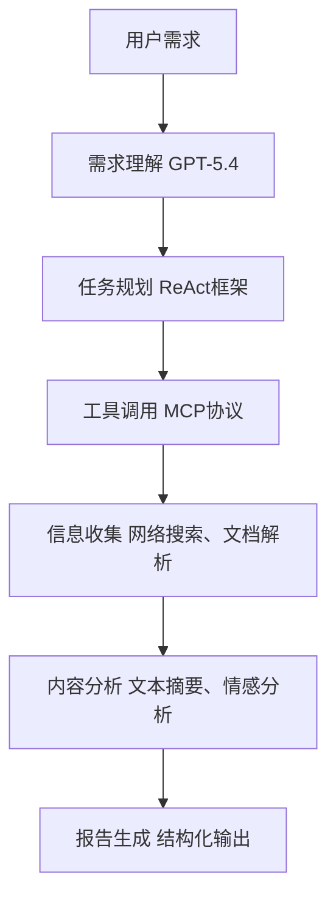

**关键代码实现**：

```python
from langchain.agents import AgentType, create_agent
from langchain.llms import OpenAI
from langchain.tools import Tool, BaseTool
import requests
from bs4 import BeautifulSoup
import json

# 定义工具
class WebSearchTool(BaseTool):
    name = "web_search"
    description = "用于执行网络搜索查询"
    
    def _run(self, query: str):
        # 简化的网络搜索实现
        url = f"https://api.example.com/search?q={query}"
        response = requests.get(url)
        return json.loads(response.text)
    
    def _arun(self, query: str):
        return self._run(query)

class WebScraperTool(BaseTool):
    name = "web_scraper"
    description = "用于解析网页内容"
    
    def _run(self, url: str):
        # 简化的网页解析实现
        response = requests.get(url)
        soup = BeautifulSoup(response.text, 'html.parser')
        return soup.get_text()[:1000]  # 返回前1000个字符
    
    def _arun(self, url: str):
        return self._run(url)

# 创建Agent
llm = OpenAI(model_name="gpt-5.4", temperature=0)
tools = [WebSearchTool(), WebScraperTool()]
agent = create_agent(
    llm,
    tools,
    agent=AgentType.ZERO_SHOT_REACT_DESCRIPTION,
    verbose=True
)

# 定义调研任务
def market_research_agent(query: str):
    """
    执行市场调研任务
    """
    # 定义调研计划
    plan = [
        "第一步：了解市场概况和规模",
        "第二步：分析主要竞争对手",
        "第三步：研究技术发展趋势",
        "第四步：识别市场机会和挑战"
    ]
    
    results = []
    
    for step in plan:
        print(f"执行步骤：{step}")
        # 使用Agent执行搜索
        result = agent.run(f"{query} {step}")
        results.append({
            "step": step,
            "result": result
        })
    
    # 生成最终报告
    report = f"市场调研报告：{query}\n"
    report += "="*50 + "\n"
    
    for i, result in enumerate(results, 1):
        report += f"{i}. {result['step']}\n"
        report += f"   结果：{result['result'][:200]}...\n"
        report += "\n"
    
    return report

# 执行市场调研
report = market_research_agent("2026年AI Agent市场发展趋势")
print(report)
```

**流程图实现**：使用 Mermaid 绘制信息检索 Agent 的工作流程

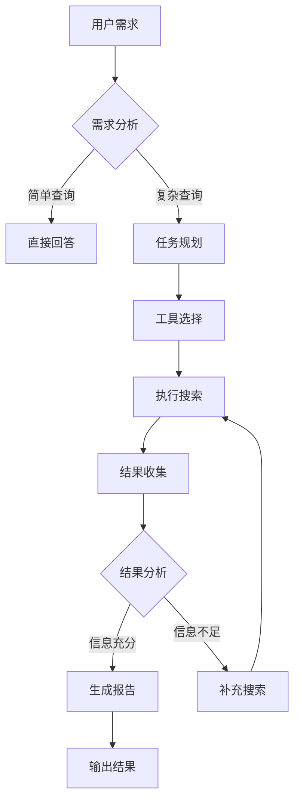

### 4.2 智能代码生成与调试 Agent

代码生成与调试是 AI Agent 在软件开发领域的重要应用，能够显著提高开发效率并减少错误。

**案例描述**：实现一个能够自动生成代码、调试程序并提供优化建议的智能编程助手。该 Agent 能够理解自然语言描述的编程需求，生成相应的代码，并在代码出现问题时进行调试和修复。

**技术架构设计**：

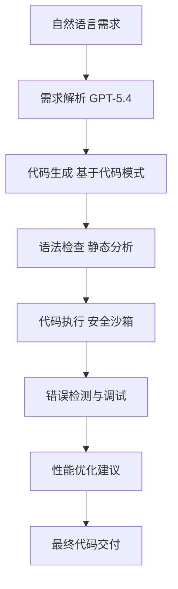

**关键代码实现**：

```python
import ast

import io

import sys

from contextlib import redirect_stdout

import traceback

class CodeGenerationAgent:

   def __init__(self):

       self.llm = OpenAI(model_name="gpt-5.4", temperature=0.7)

  

   def generate\_code(self, requirement: str):

       """

       根据自然语言需求生成代码

       """

       prompt = f"""

       请根据以下需求生成Python代码：

       {requirement}

      

       要求：

       1\. 使用清晰的变量命名和注释

       2\. 处理边界条件和异常情况

       3\. 确保代码可读性和可维护性

       """

      

       code = self.llm.predict(prompt)

       return code

  

   def debug\_code(self, code: str, inputs: list = None):

       """

       调试Python代码

       """

       try:

           # 编译代码

           ast.parse(code)

          

           # 在安全环境中执行代码

           if inputs is None:

               inputs = \[]

          

           # 重定向输出

           output = io.StringIO()

           with redirect\_stdout(output):

               exec(code, {"\_\_name\_\_": "\_\_main\_\_"})

          

           return {

               "status": "success",

               "output": output.getvalue(),

               "errors": \[]

           }

       except Exception as e:

           error\_info = traceback.format\_exception(type(e), e, e.\_\_traceback\_\_)

           return {

               "status": "error",

               "output": "",

               "errors": error\_info

           }

  

   def optimize\_code(self, code: str):

       """

       分析代码并提供优化建议

       """

       prompt = f"""

       请分析以下Python代码并提供优化建议：

       {code}

      

       分析维度：

       1\. 代码复杂度和性能

       2\. 代码风格和规范

       3\. 错误处理和异常安全

       4\. 可扩展性和可维护性

       """

      

       analysis = self.llm.predict(prompt)

       return analysis

\# 示例使用

agent = CodeGenerationAgent()

\# 生成代码

requirement = "实现一个斐波那契数列生成器，支持迭代和递归两种方式"

generated\_code = agent.generate\_code(requirement)

print("生成的代码：")

print(generated\_code)

\# 调试代码

print("\n调试代码：")

debug\_result = agent.debug\_code(generated\_code)

if debug\_result\["status"] == "error":

   print("发现错误：")

   for error in debug\_result\["errors"]:

       print(error)

else:

   print("代码执行成功！")

   print("输出：", debug\_result\["output"])

\# 优化建议

print("\n优化建议：")

optimization = agent.optimize\_code(generated\_code)

print(optimization)
```

**时序图实现**：

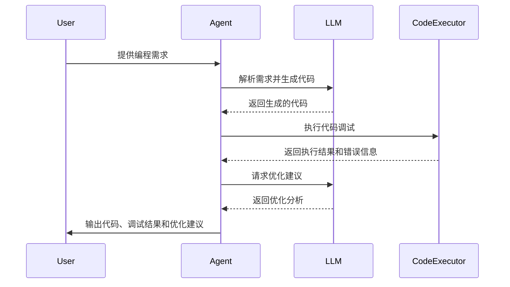

### 4.3 多轮对话管理系统

多轮对话管理是通用型 AI Agent 实现自然、流畅交互的核心技术，需要处理上下文理解、对话状态管理和对话策略优化等复杂问题。

**案例描述**：实现一个能够进行多轮对话的智能客服系统，该系统能够理解用户意图、维护对话上下文、处理多轮交互并最终解决用户问题。

**技术架构设计**：

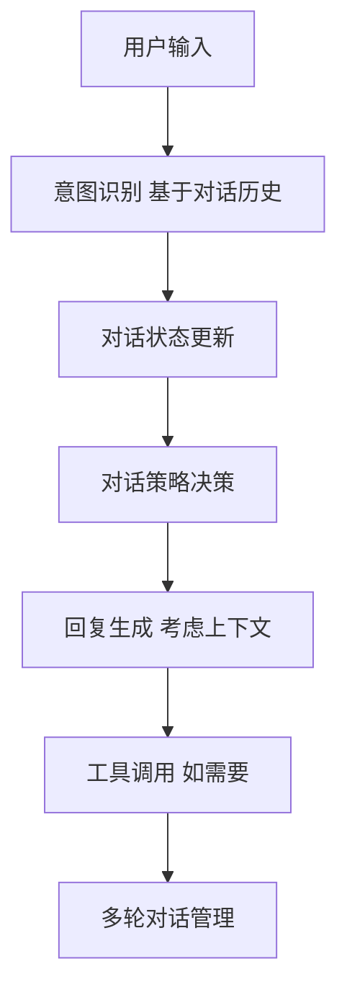

**关键代码实现**：

```python
from typing import Dict, List, Any

import json

class DialogueManager:

   def __init__(self):

       self.dialogue\_history = \[]  # 存储对话历史

       self.context = {}  # 对话上下文

  

   def process_input(self, user\_input: str):

       """

       处理用户输入

       """

       # 构建完整的对话上下文

       full\_context = self.\_build\_context(user\_input)

      

       # 使用LLM处理对话

       response = self.\_handle\_dialogue(full\_context)

      

       # 更新对话历史

       self.dialogue\_history.append({

           "user": user\_input,

           "agent": response

       })

      

       return response

  

   def \_build\_context(self, user\_input: str) -> str:

       """

       构建对话上下文

       """

       context\_str = "对话历史：\n"

       for i, turn in enumerate(self.dialogue\_history\[-5:], 1):  # 保留最近5轮对话

           context\_str += f"{i}. 用户：{turn\['user']}\n"

           context\_str += f"   Agent：{turn\['agent']}\n"

      

       context\_str += f"\n当前输入：用户：{user\_input}\n"

       context\_str += "Agent："

       return context\_str

  

   def \_handle\_dialogue(self, context: str) -> str:

       """

       使用LLM处理对话

       """

       # 简化的对话处理逻辑

       # 实际应用中需要更复杂的对话策略

      

       # 检查是否需要调用工具

       if "查询" in context or "搜索" in context:

           # 调用工具获取信息

           tool\_result = self.\_call\_tool(context)

           return f"根据查询结果：{tool\_result}"

       elif "历史订单" in context or "账户信息" in context:

           # 模拟数据库查询

           db\_result = self.\_query\_database(context)

           return f"您的账户信息：{db\_result}"

       else:

           # 直接回答

           return "我理解您的需求，正在为您处理..."

  

   def \_call\_tool(self, query: str) -> str:

       """

       调用外部工具

       """

       # 简化的工具调用实现

       return "工具返回的结果"

  

   def \_query\_database(self, query: str) -> str:

       """

       模拟数据库查询

       """

       return "数据库查询结果"

  

   def get\_dialogue\_summary(self) -> str:

       """

       获取对话摘要

       """

       summary\_prompt = f"""

       请总结以下对话的主要内容和用户需求：

       {json.dumps(self.dialogue\_history, ensure\_ascii=False, indent=2)}

      

       要求：

       1\. 识别用户的核心诉求

       2\. 总结已完成的对话内容

       3\. 指出需要进一步处理的事项

       """

      

       summary = self.llm.predict(summary\_prompt)

       return summary

\# 示例使用

dm = DialogueManager()

print("=== 智能客服系统 ===")

print("输入'退出'结束对话")

while True:

   user\_input = input("用户：")

   if user\_input.lower() == "退出":

       break

  

   response = dm.process_input(user\_input)

   print(f"Agent：{response}")

\# 生成对话摘要

summary = dm.get\_dialogue\_summary()

print("\n=== 对话摘要 ===")

print(summary)
```

**状态图实现**：使用 Mermaid 绘制对话状态机

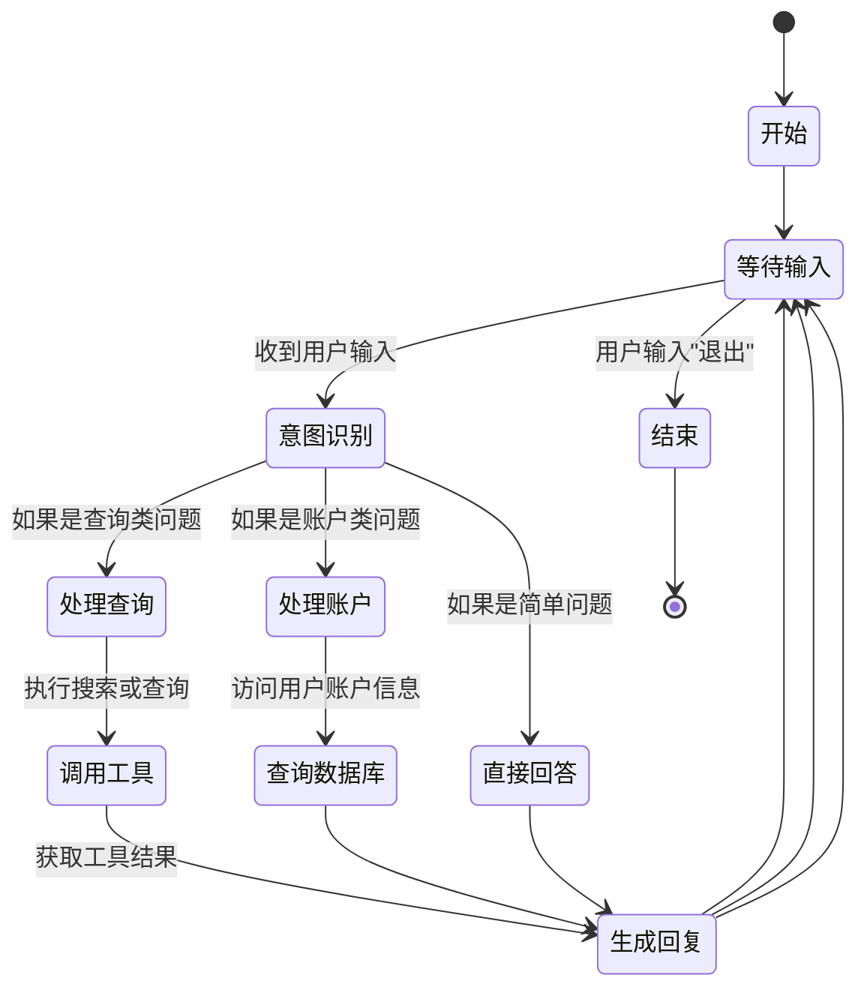

### 4.4 综合型智能助手

综合型智能助手是通用型 AI Agent 的典型应用，能够同时处理多种类型的任务，展现出真正的智能化和通用性。

**案例描述**：实现一个能够处理日程管理、信息查询、文件操作、代码执行等多种任务的综合型智能助手。该助手具备多模态交互能力，能够理解文本、语音和图像输入。

**技术架构设计**：

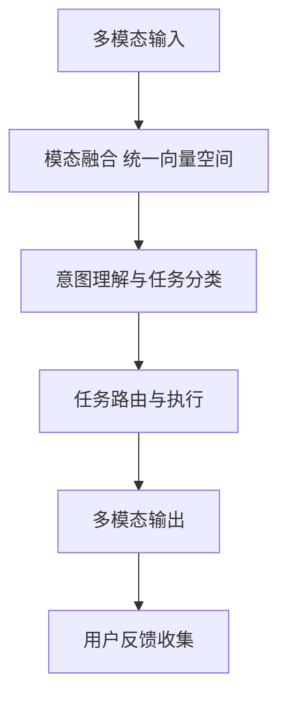

```python
import datetime

import os

import shutil

import speech_recognition as sr

from PIL import Image

import pytesseract
import json

class MultiModalAssistant:

   def __init__(self):

       self.llm = OpenAI(model_name="gpt-5.4", temperature=0.5)

       self.memory = {}  # 存储用户偏好和历史信息

  

   def process_input(self, input\_data: dict):

       """

       处理多模态输入

       """

       # 解析输入类型

       input\_type = input\_data.get("type", "text")

       content = input\_data.get("content", "")

      

       if input\_type == "text":

           return self._process_text(content)

       elif input\_type == "voice":

           return self._process_voice(content)

       elif input\_type == "image":

           return self._process_image(content)

       else:

           return "不支持的输入类型"

  

   def _process_text(self, text: str):

       """

       处理文本输入

       """

       # 意图识别

       intent = self._identify_intent(text)

      

       if intent == "schedule":

           return self._handle_schedule(text)

       elif intent == "search":

           return self._handle_search(text)

       elif intent == "file":

           return self._handle_file_operation(text)

       elif intent == "code":

           return self._handle_code_execution(text)

       else:

           return self._handle_general_query(text)

  

   def _process_voice(self, audio\_path: str):

       """

       处理语音输入

       """

       # 使用语音识别

       r = sr.Recognizer()

       with sr.AudioFile(audio\_path) as source:

           audio = r.record(source)

      

       try:

           text = r.recognize\_google(audio, language="zh-CN")

           return self._process_text(text)

       except sr.UnknownValueError:

           return "无法识别语音"

       except sr.RequestError as e:

           return f"语音识别服务错误：{e}"

  

   def _process_image(self, image\_path: str):

       """

       处理图像输入

       """

       # 使用OCR识别文字

       try:

           text = pytesseract.image\_to\_string(Image.open(image\_path))

           return self._process_text(f"图片中的文字：{text}")

       except Exception as e:

           return f"图片处理失败：{e}"

  

   def _identify_intent(self, text: str):

       """

       识别用户意图

       """

       prompt = f"""

       识别以下用户输入的意图：

       {text}

      

       可能的意图：

       \- schedule: 日程管理

       \- search: 信息查询

       \- file: 文件操作

       \- code: 代码执行

       \- general: 一般对话

       """

      

       intent = self.llm.predict(prompt).strip()

       return intent

  

   def _handle_schedule(self, text: str):

       """

       处理日程管理任务

       """

       prompt = f"""

       解析以下日程安排请求：

       {text}

      

       输出格式：

       {{

           "date": "YYYY-MM-DD",

           "time": "HH:MM",

           "event": "事件描述",

           "duration": "持续时间"

       }}

       """

      

       schedule = json.loads(self.llm.predict(prompt))

       # 实际应用中需要与日历系统集成

       return f"已为您安排日程：{schedule\['event']}，时间：{schedule\['date']} {schedule\['time']}"

  

   def _handle_search(self, query: str):

       """

       处理信息查询

       """

       # 简化的搜索实现

       results = self._perform_search(query)

       return f"搜索结果：{results\[:200]}..."

  

   def _handle_file_operation(self, command: str):

       """

       处理文件操作请求

       """

       # 解析文件操作命令

       operations = {

           "创建文件": self._create_file,

           "删除文件": self._delete_file,

           "移动文件": self._move_file,

           "复制文件": self._copy_file

       }

      

       for op, func in operations.items():

           if op in command:

               return func(command)

      

       return "不支持的文件操作"

  

   def _handle_code_execution(self, code: str):

       """

       处理代码执行请求

       """

       # 在安全环境中执行代码

       result = self._execute_code_safely(code)

       return f"代码执行结果：{result}"

  

   def _handle_general_query(self, query: str):

       """

       处理一般查询

       """

       return self.llm.predict(query)

  

   def _perform_search(self, query: str):

       """

       执行网络搜索

       """

       # 实际应用中需要调用搜索引擎API

       return "搜索结果"

  

   def _create_file(self, command: str):

       """

       创建文件

       """

       # 解析文件名和内容

       # 简化实现

       return "文件创建成功"

  

   def _delete_file(self, command: str):

       """

       删除文件

       """

       return "文件删除成功"

  

   def _move_file(self, command: str):

       """

       移动文件

       """

       return "文件移动成功"

  

   def _copy_file(self, command: str):

       """

       复制文件

       """

       return "文件复制成功"

  

   def _execute_code_safely(self, code: str):

       """

       在安全环境中执行代码

       """

       try:

           # 使用限制的执行环境

           exec(code, {"__builtins__": {}})

           return "代码执行成功"

       except Exception as e:

           return f"代码执行失败：{str(e)}"

\# 示例使用

assistant = MultiModalAssistant()

\# 文本输入示例

print("=== 综合型智能助手 ===")

print("支持文本、语音、图像输入")

\# 处理文本输入

text_input = {

   "type": "text",

   "content": "明天下午3点安排一个会议，讨论AI Agent项目进展"

}

response = assistant.process_input(text_input)

print(f"响应：{response}")

\# 处理语音输入（示例）

voice_input = {

   "type": "voice",

   "content": "audio.wav"  # 实际语音文件路径

}

response = assistant.process_input(voice_input)

print(f"响应：{response}")

\# 处理图像输入（示例）

image_input = {

   "type": "image",

   "content": "example.png"  # 实际图像文件路径

}

response = assistant.process_input(image_input)

print(f"响应：{response}")
```

**组件交互图**：使用 Mermaid 绘制系统组件交互关系

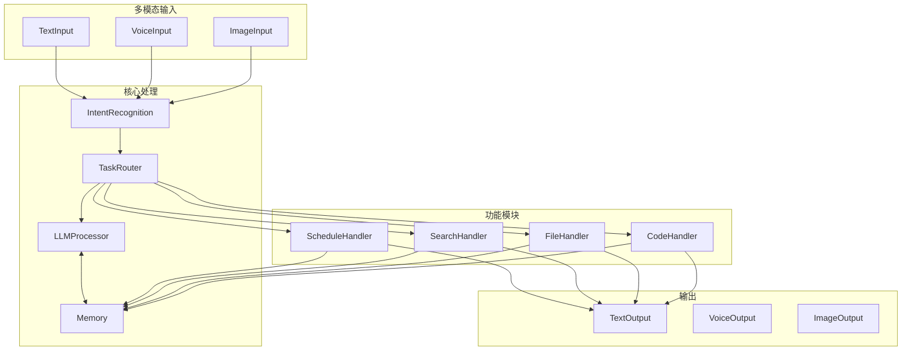

## 5. 可视化技术实现

### 5.1 核心流程

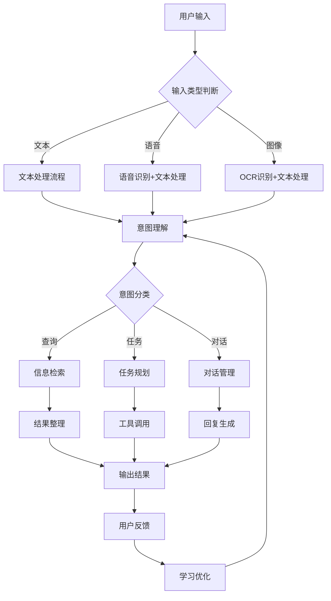

<br />

**Python 代码**

```Python
from graphviz import Digraph

def create\_agent\_flowchart():

   """

   创建AI Agent工作流程流程图

   """

   dot = Digraph(comment='AI Agent Workflow', format='png')
   # 定义节点

   dot.node('start', '开始', shape='oval')

   dot.node('input', '用户输入', shape='rect')

   dot.node('perception', '感知模块', shape='rect')

   dot.node('decision', '决策模块', shape='diamond')

   dot.node('action', '执行模块', shape='rect')

   dot.node('memory', '记忆模块', shape='rect')

   dot.node('reflection', '反思模块', shape='rect')

   dot.node('output', '系统输出', shape='rect')

   dot.node('end', '结束', shape='oval')


   # 定义流程

   dot.edges(\[

       ('start', 'input'),

       ('input', 'perception'),

       ('perception', 'decision'),

       ('decision', 'action', label='需要工具调用'),

       ('action', 'memory'),

       ('memory', 'reflection'),

       ('reflection', 'decision'),

       ('decision', 'output', label='直接输出'),

       ('output', 'end')

   ])

  

   # 定义循环

   dot.edge('reflection', 'perception', style='dotted', color='red')

  

   # 设置节点样式

   dot.attr('node', style='filled', color='lightblue')

   dot.attr('edge', color='black', arrowhead='vee')

  

   return dot

\# 生成流程图

flowchart = create\_agent\_flowchart()

flowchart.render('agent\_workflow', view=True)
```

**高级流程图特性**：

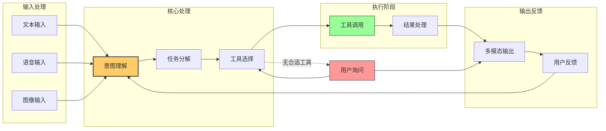

### 5.2 时序

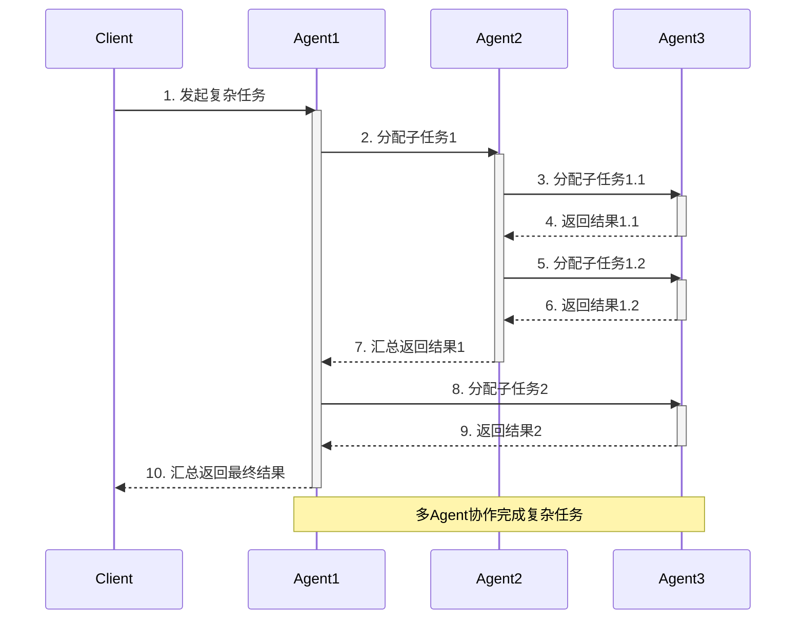

### 5.3 AI Agent 的系统结构和组件关系

<br />
````
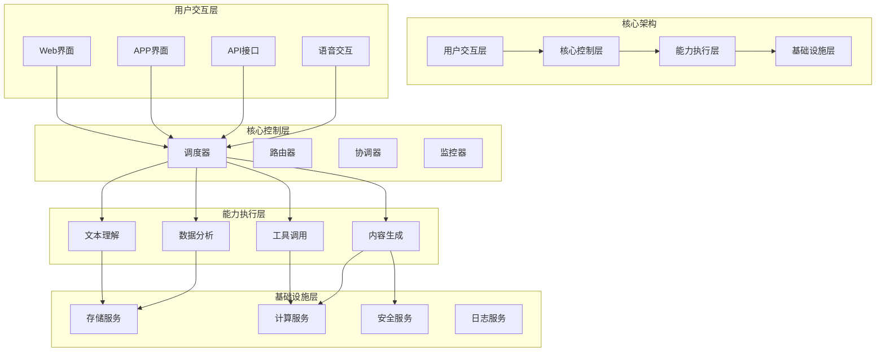

<br />

**高级架构图特性**：

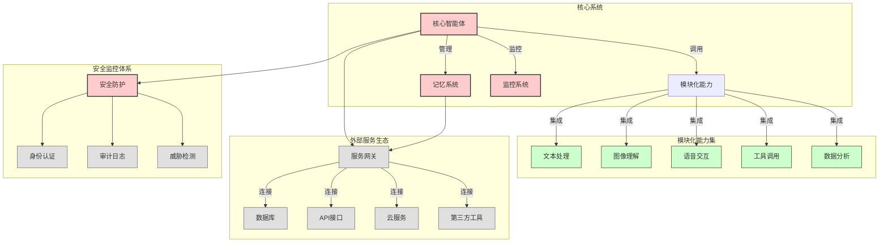

##

## 生态与发展

**官方文档和框架资源**：

1. **LangChain 官方文档**：作为最成熟的 Agent 开发框架，LangChain 的官方文档提供了完整的 API 参考和使用指南。建议从快速入门指南开始，逐步深入到高级功能。
2. **OpenAI API 文档**：掌握 OpenAI 的 API 接口使用，特别是最新的 GPT-5.4 和 Function Calling 功能。了解如何通过 API 实现与大语言模型的交互。
3. **AutoGen GitHub 仓库**：微软开源的 AutoGen 框架提供了优秀的多智能体协作示例。通过阅读源代码和示例，可以深入理解多智能体系统的设计原理。
4. **MCP 协议规范**：学习 Model Context Protocol 的官方规范，了解如何实现标准化的工具调用和上下文管理[(140)](http://m.toutiao.com/group/7615496948400931362/?upstream_biz=doubao)。

**学术论文和研究资源**：

1. **经典论文**：

- 《ReAct: Synergizing Reasoning and Acting in Language Models》- 理解推理与行动结合的基础理论
- 《Large Language Model Based Agents: A Survey》- 了解 Agent 技术的全面综述
- 《Multi-Agent Systems: Algorithmic, Game-Theoretic, and Logical Foundations》- 多智能体系统的理论基础

1. **最新研究**：关注 2026 年发表在顶级会议上的最新研究成果，特别是关于多模态 Agent、具身智能、安全对齐等方向的论文。推荐关注 arXiv 上的最新预印本。
2. **技术报告**：阅读各大科技公司发布的技术报告，如 OpenAI 的技术博客、Google 的研究报告、Anthropic 的安全研究等。

**实践项目和案例**：

1. **开源项目**：

- OpenClaw：GitHub 星标超过 28 万的热门项目，学习其架构设计和实现思路
- LangChain Examples：官方提供的各种示例项目，涵盖了常见的应用场景
- AutoGen Examples：微软提供的多智能体协作示例[(134)](http://m.toutiao.com/group/7615495099375518235/?upstream_biz=doubao)

1. **商业案例**：研究成功的商业应用案例，如智能客服系统、智能写作助手、自动化数据分析工具等。分析其技术架构、商业模式和用户体验设计。
2. **竞赛项目**：参加相关的技术竞赛，如 HackerRank 的 AI Agent 挑战赛、Kaggle 上的相关竞赛等，通过实战提升技术能力。

**社区和交流平台**：

1. **开发者社区**：

- GitHub：关注热门的 Agent 相关开源项目，参与 Issue 讨论和 Pull Request
- Reddit：参与 r/LearnMachineLearning 和 r/ArtificialInteligence 等社区讨论
- Stack Overflow：在遇到技术问题时寻求帮助，也可以分享自己的经验

1. **技术论坛**：

- 智源社区：关注 AI Agent 相关的技术活动和讲座
- 机器之心：获取最新的技术动态和行业分析
- InfoQ：学习企业级 AI Agent 的实践经验[(139)](https://event.baai.ac.cn/)

1. **线下活动**：参加相关的技术会议和 Meetup，如 AICon、ArchSummit 等，与行业专家面对面交流。

### 6.3 2026 年技术发展趋势

**技术发展的六大趋势**：

1. **多智能体协作成为标配**：2026 年被称为 "多智能体上岗元年"，从 "独狼" 助手进化为 "狼群" 战术。MCP 与 A2A 通信协议成为行业标准，不同企业的智能体将拥有通用语言，跨平台协作完成复杂任务流成为可能。
2. **从 "能说" 到 "能做" 的关键转型**：单模型成功率小于 60%，而 Multi-Agent 成功率超过 85%。智能体不再满足于回答问题，而是能够执行复杂的多步骤任务，如跨应用策划旅行、协助科研实验等。
3. **协议分层融合成为行业标准**：2026 年的技术发展呈现出明显的标准化趋势。MCP 协议成为 Agent 生态的基石，被认为是 "2026 年不支持 MCP 的 Agent 工具链，等于 2020 年不支持 REST API"。同时，A2A 协议的成熟使得不同厂商的 Agent 能够实现真正的互操作性[(140)](http://m.toutiao.com/group/7615496948400931362/?upstream_biz=doubao)。
4. **智能体式商业模式兴起**：出现了全新的商业模式 ——Agent-as-a-Service（AaaS）。包括订阅制（如每月 $10 租用电商运营 Agent）、按效果付费（如 AI 销售 Agent 按成交金额抽成）、分成模式（如 AI 内容创作者与平台分成广告收入）等。这种模式使得普通人可以 "雇佣"AI 员工帮自己赚钱，也可以把自己的技能封装成 Agent 出售。
5. **垂直领域深度渗透**：行业专用 AI 深度渗透金融、医疗、法律、制造等领域，垂直 AI 更准、更稳、更合规。每个行业都在发展适合自己的专用智能体，形成了 "通用平台 + 行业插件" 的生态格局[(4)](https://www.iesdouyin.com/share/video/7615940759758284361/?region=\&mid=7615940738731346714\&u_code=0\&did=MS4wLjABAAAANwkJuWIRFOzg5uCpDRpMj4OX-QryoDgn-yYlXQnRwQQ\&iid=MS4wLjABAAAANwkJuWIRFOzg5uCpDRpMj4OX-QryoDgn-yYlXQnRwQQ\&with_sec_did=1\&video_share_track_ver=\&titleType=title\&share_sign=NV93SNxBTCn6QSCX_fJ1pgWDAu2H6HgMuShloksVJ94-\&share_version=280700\&ts=1773321209\&from_aid=1128\&from_ssr=1\&share_track_info=%7B%22link_description_type%22%3A%22%22%7D)。
6. **技术架构创新**：

- 分布式网络架构：AI 之间有通用语言，不同公司的 AI 也能合作
- 长期记忆突破：AI 能独立跟进完整项目，全程不掉线
- Computer Use 成标配：AI 能像人一样操作电脑、ERP、Excel、CRM，真正实现跨系统自动化[(4)](https://www.iesdouyin.com/share/video/7615940759758284361/?region=\&mid=7615940738731346714\&u_code=0\&did=MS4wLjABAAAANwkJuWIRFOzg5uCpDRpMj4OX-QryoDgn-yYlXQnRwQQ\&iid=MS4wLjABAAAANwkJuWIRFOzg5uCpDRpMj4OX-QryoDgn-yYlXQnRwQQ\&with_sec_did=1\&video_share_track_ver=\&titleType=title\&share_sign=NV93SNxBTCn6QSCX_fJ1pgWDAu2H6HgMuShloksVJ94-\&share_version=280700\&ts=1773321209\&from_aid=1128\&from_ssr=1\&share_track_info=%7B%22link_description_type%22%3A%22%22%7D)

**技术发展的关键驱动因素**：

1. **大模型能力跃升**：GPT-5.4、Claude 4、Gemini 3.1 Pro 等模型在推理能力、工具调用、长文本理解等方面的突破性进展，为 Agent 提供了更强大的 "大脑"。特别是在多模态理解和复杂推理方面的能力提升，使得 Agent 能够处理更复杂的任务。
2. **成本效益显著改善**：企业级 Agent 的开发成本下降 40%，推理延迟降至 200ms，功能复用率提升 60%。同时，云计算资源的成本持续下降，使得大规模部署 Agent 系统变得经济可行。
3. **标准化和互操作性提升**：MCP、A2A 等标准化协议的成熟，大大降低了 Agent 开发和集成的复杂度。开发者可以专注于业务逻辑的实现，而不必花费大量精力在接口适配和协议转换上。
4. **应用场景的爆发式增长**：从客服、营销、内容创作到数据分析、代码生成、知识管理，AI Agent 的应用场景呈现爆发式增长。每个行业都在探索如何利用 Agent 技术提升效率和创造价值。

**未来发展预测**：

根据行业专家的预测，2026-2028 年 AI Agent 技术将呈现以下发展趋势：

1. **2027 年**：多模态融合标准化，主流厂商形成统一接口标准，应用开发成本降低 80%。
2. **2028 年**：上下文长度平民化，千万 Token 处理成为消费级硬件标配能力。
3. **2029 年**：智能体协作网络形成，多智能体自主协商与协作，形成分布式智能系统。技术栈垂直整合，三大技术深度集成，形成 "感知 - 理解 - 执行" 一体化架构。
4. **商业化前景**：预计到 2026 年底，40% 的企业应用将嵌入 AI Agent，全球 AI Agent 市场规模将达到 187 亿美元。到 2028 年，这一数字可能超过 500 亿美元[(68)](https://www.iesdouyin.com/share/video/7615986185583873299/?region=\&mid=7615986589679766298\&u_code=0\&did=MS4wLjABAAAANwkJuWIRFOzg5uCpDRpMj4OX-QryoDgn-yYlXQnRwQQ\&iid=MS4wLjABAAAANwkJuWIRFOzg5uCpDRpMj4OX-QryoDgn-yYlXQnRwQQ\&with_sec_did=1\&video_share_track_ver=\&titleType=title\&share_sign=RyvzPSPiYcp4BLHIWe6c93kCeeClDZik_eKzQsvIfBc-\&share_version=280700\&ts=1773321279\&from_aid=1128\&from_ssr=1\&share_track_info=%7B%22link_description_type%22%3A%22%22%7D)。

对于技术学习者而言，2026 年是进入 AI Agent 领域的最佳时机。技术已经成熟，应用场景丰富，市场需求旺盛，同时人才缺口巨大。通过系统的学习和持续的实践，完全有可能在这个快速发展的领域中找到自己的位置并创造价值。关键是要保持学习的热情和创新的精神，紧跟技术发展的步伐，不断提升自己的专业能力。
